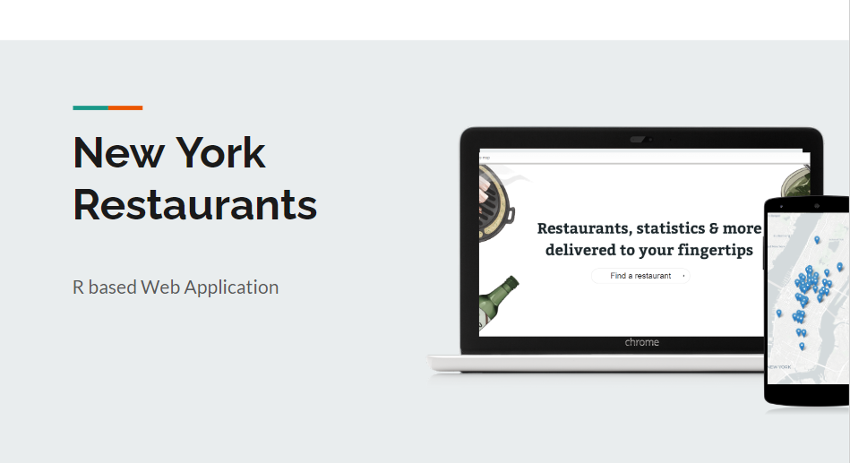
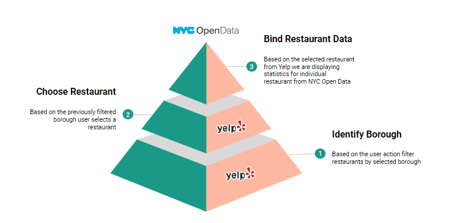
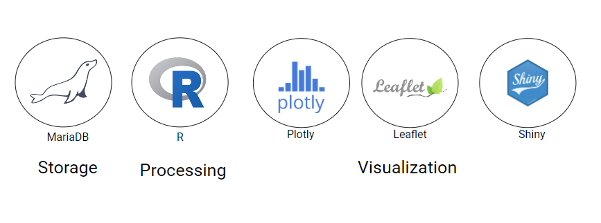
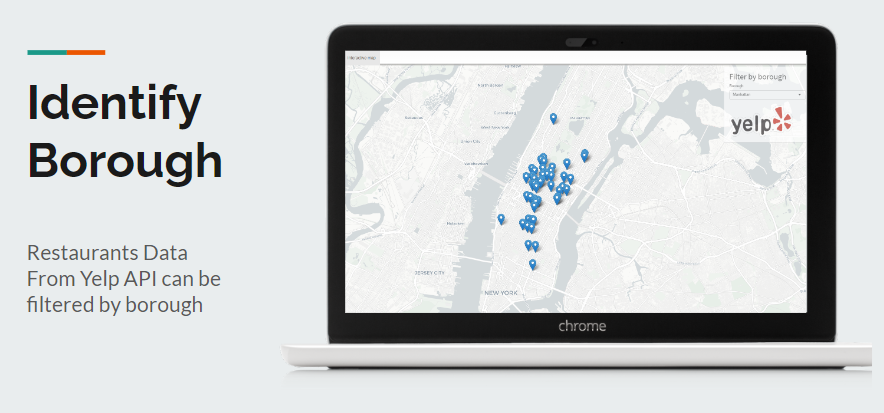
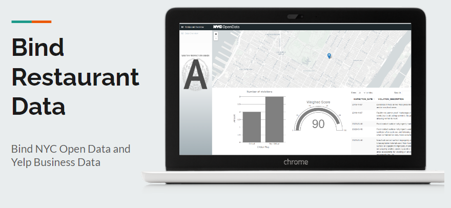

# NYC Restaurant Web Aplication

For the R project I chose NYC Restaurants Health Ispection Open Data Source provided by NYC Open Data in combination with YELP Fusion API to create R based web application.



Because I was working with 2 data sources, one which was living on dedicated server in the database and another one which I would get from API response, I  had to establish a point in which I could bind these 2 sources. This meant that I would

- Establish Yelp API Call and provide a user with a select input to filter data by boroughs
- Secondly I would further allow user to select a restaurant in selected borough and pass name of the restaurant, zipcode, lat and longit as the query parameters in the request itself
- Lastly I would use parameters I have previously passed in the request to bind restaurant data and provide certain information about a restaurant from NYC Open data set 




## Problem Statement, Motivation and Purpose

Choosing a favorite restaurant in New York City is a joyful task with myriad possibilities depending on the occasion, mood and even the time of year. Being among the most diversed cities in the world with around 800 native languages, you can find any type of restaurant with varieties of cuisines.

DIfferent mobile and web application as Yelp, Google Business Reviews and Grubhub are often a starting research point for many as it allows them to get an idea of other restaurant goers' experience at each restaurant.

In order to operate every restaurant is graded and has to pass special program inspection conducted by NYC every year which is also one important aspect that many restaurant goers will consider prior to eating at a restaurant. However, not that many applications that offer restaurant search offer more details on restaurant health over time.

Some of the problem statements:
- Lack of sanitary based restaurant ranking in the existing applications
- Existing applications rank restaurants based on mostly anonymous user feedback

Motivation for this research is to analyze NYC inspection data, better understand overall possible user journey and how to incorporate inspection data into restaurant search.

## About Data Set 

The data set was exported in its original size of 301194 records in .csv format from the [NYC OPEN DATA -  Data Set Source](https://data.cityofnewyork.us/Health/DOHMH-New-York-City-Restaurant-Inspection-Results/43nn-pn8j)

The dataset contains every sustained or not yet adjudicated violation citation from every full or special program inspection conducted up to three years prior to the most recent inspection for restaurants in an active status on the RECORD DATE (date of the data pull). Establishments are uniquely identified by their CAMIS (record ID) number.Thousands of restaurants start business and go out of business every year, only restaurants in an active status are included in the dataset. 

Establishments with inspection date of 1/1/1900 are new establishments that have not yet received an inspection. I excluded these from the data set that was used for the individual business case data analysis. Restaurants that received no violations are represented by a single row and coded as having no violations using the ACTION field. 

All of the basic fields are explained in the table below: 

 **Column Name**       	| **Column Description**                                                          	|
|-----------------------	|---------------------------------------------------------------------------------	|
|                       	|                                                                                 	|
| CAMIS                 	| Unique identifier for the establishment (restaurant)                            	|
| DBA                   	| Establishment (restaurant) name                                                 	|
| BORO                  	| Borough of establishment (restaurant) location                                  	|
| BUILDING              	| Building number for establishment (restaurant) location                         	|
| STREET                	| Street name for establishment (restaurant) location                             	|
| ZIPCODE               	| Zip code of establishment (restaurant) location                                 	|
| PHONE                 	| Phone number                                                                    	|
| CUISINE DESCRIPTION   	| Establishment (restaurant) cuisine                                              	|
| INSPECTION DATE       	|                                                                                 	|
| ACTION                	| Action associated with each establishment (restaurant) inspection               	|
| VIOLATION CODE        	| Violation code associated with an establishment (restaurant) inspection         	|
| VIOLATION DESCRIPTION 	| Violation description associated with an establishment  (restaurant) inspection 	|
| CRITICAL FLAG         	| Indicator of critical violation                                                 	|
| SCORE                 	| Total score for a particular inspection                                         	|
| GRADE                 	| Grade associated with the inspection                                            	|
| GRADE DATE            	| Date when grade was issued to the establishment (restaurant)                    	|
| RECORD DATE           	| Date record was added to dataset                                                	|
| INSPECTION TYPE       	| A combination of the inspection program and the type of inspection performed    	|

There is also one new feature I created out of existing one and that is weighed score. I basically subtracted SCORE from 100 to get a score that is easier for humans to comprehend at first glance meaning the closer you are to 100 the better score you have. This also helps me visualize the score easier in charts in the app.

## Tools & Methods



The tools that were used for the project are: 

- MariaDB, which is a fork of MySQL, for data storage and filtering
- R for data processing
- And Plotly data visualization

In addition to this I used Shiny Router which helped me creating specific subpages via URL and RMySQL library that helped me open a connection to a database that lives on specified server.

### CSV Import, Setting up database connection and schema creation

In order to easier manipulate with data set that has more then 300k records I decided to use MySQL Workbench and import data from CSV to db format. 

Here are some steps:

1. I creted a following schema **nyc_restaurants** with **DOHMH_New_York_City_Restaurant_Inspection_Results** table
2. I decided to not import data using Table Data Import Wizard as it would take a lot of time. Instead I loaded the data from csv to db format using following command: 
```
LOAD DATA INFILE '/var/lib/mysql/DOHMH_New_York_City_Restaurant_Inspection_Results.csv'
INTO TABLE `DOHMH_New_York_City_Restaurant_Inspection_Results`
FIELDS TERMINATED BY ',' OPTIONALLY ENCLOSED BY '"'
IGNORE 1 ROWS;
```
3. I did some data cleanup and created a view **clean_data** that i will use later on in Python Notebook to create dataframes. I did data cleanup and view creation by running following command: 

```
CREATE ALGORITHM = UNDEFINED DEFINER = `root` @`%` SQL SECURITY DEFINER VIEW `clean_data` AS 
select 
  `DOHMH_New_York_City_Restaurant_Inspection_Results`.`CAMIS` AS `CAMIS`, 
  `DOHMH_New_York_City_Restaurant_Inspection_Results`.`DBA` AS `DBA`, 
  `DOHMH_New_York_City_Restaurant_Inspection_Results`.`BORO` AS `BORO`, 
  `DOHMH_New_York_City_Restaurant_Inspection_Results`.`BUILDING` AS `BUILDING`, 
  `DOHMH_New_York_City_Restaurant_Inspection_Results`.`STREET` AS `STREET`, 
  `DOHMH_New_York_City_Restaurant_Inspection_Results`.`ZIPCODE` AS `ZIPCODE`, 
  `DOHMH_New_York_City_Restaurant_Inspection_Results`.`PHONE` AS `PHONE`, 
  `DOHMH_New_York_City_Restaurant_Inspection_Results`.`CUISINE DESCRIPTION` AS `CUISINE_DESCRIPTION`, 
  str_to_date(
    `DOHMH_New_York_City_Restaurant_Inspection_Results`.`INSPECTION DATE`, 
    '%m/%d/%Y'
  ) AS `INSPECTION_DATE`, 
  `DOHMH_New_York_City_Restaurant_Inspection_Results`.`ACTION` AS `ACTION`, 
  `DOHMH_New_York_City_Restaurant_Inspection_Results`.`VIOLATION CODE` AS `VIOLATION_CODE`, 
  `DOHMH_New_York_City_Restaurant_Inspection_Results`.`VIOLATION DESCRIPTION` AS `VIOLATION_DESCRIPTION`, 
  `DOHMH_New_York_City_Restaurant_Inspection_Results`.`CRITICAL FLAG` AS `CRITICAL_FLAG`, 
  `DOHMH_New_York_City_Restaurant_Inspection_Results`.`SCORE` AS `SCORE`, 
  100 - `DOHMH_New_York_City_Restaurant_Inspection_Results`.`SCORE` AS `WEIGHED_SCORE`, 
  `DOHMH_New_York_City_Restaurant_Inspection_Results`.`GRADE` AS `GRADE`, 
  str_to_date(
    `DOHMH_New_York_City_Restaurant_Inspection_Results`.`GRADE DATE`, 
    '%m/%d/%Y'
  ) AS `GRADE_DATE`, 
  str_to_date(
    `DOHMH_New_York_City_Restaurant_Inspection_Results`.`RECORD DATE`, 
    '%m/%d/%Y'
  ) AS `RECORD_DATE`, 
  `DOHMH_New_York_City_Restaurant_Inspection_Results`.`INSPECTION TYPE` AS `INSPECTION_TYPE`, 
  `DOHMH_New_York_City_Restaurant_Inspection_Results`.`Latitude` AS `Latitude`, 
  `DOHMH_New_York_City_Restaurant_Inspection_Results`.`Longitude` AS `Longitude`, 
  `DOHMH_New_York_City_Restaurant_Inspection_Results`.`Community Board` AS `Community_Board`, 
  `DOHMH_New_York_City_Restaurant_Inspection_Results`.`Council District` AS `Council_District`, 
  `DOHMH_New_York_City_Restaurant_Inspection_Results`.`Census Tract` AS `Census_Tract`, 
  `DOHMH_New_York_City_Restaurant_Inspection_Results`.`BIN` AS `BIN`, 
  `DOHMH_New_York_City_Restaurant_Inspection_Results`.`BBL` AS `BBL`, 
  `DOHMH_New_York_City_Restaurant_Inspection_Results`.`NTA` AS `NTA` 
from 
  `DOHMH_New_York_City_Restaurant_Inspection_Results` 
where 
  `DOHMH_New_York_City_Restaurant_Inspection_Results`.`BORO` <> '0' 
  and str_to_date(
    `DOHMH_New_York_City_Restaurant_Inspection_Results`.`GRADE DATE`, 
    '%m/%d/%Y'
  ) > cast('2018-01-01' as date);

```
3. To connect to the database I used MYSQLdb interface for connecting to a MySQL database server from R. To establish connection I used following code snippet: 
```
        con <- dbConnect(MySQL(),
                         user = 'user',
                         password = 'password',
                         host = 'host',
                         dbname='databasename')
```
## User Journey
###Step One
When a user comes to a leaflet interactive map that shows list of the restaurants that we get as a json response from Yelp api, by default Manhattan borough is selected. 



###Step Two
After that user will select a restaurant and get a popup that contains basic information about restaurant including Yelp Review Score. By clicking on restaurant name new page will be open. 

###Step Three
With basic analytics from NYC Inspection Dataset for specified restaurant in which we have plot with number of violations on which we have critical and non critical violations, we have gauge chart representing weighed score and tabular preview of violations with descriptions  


